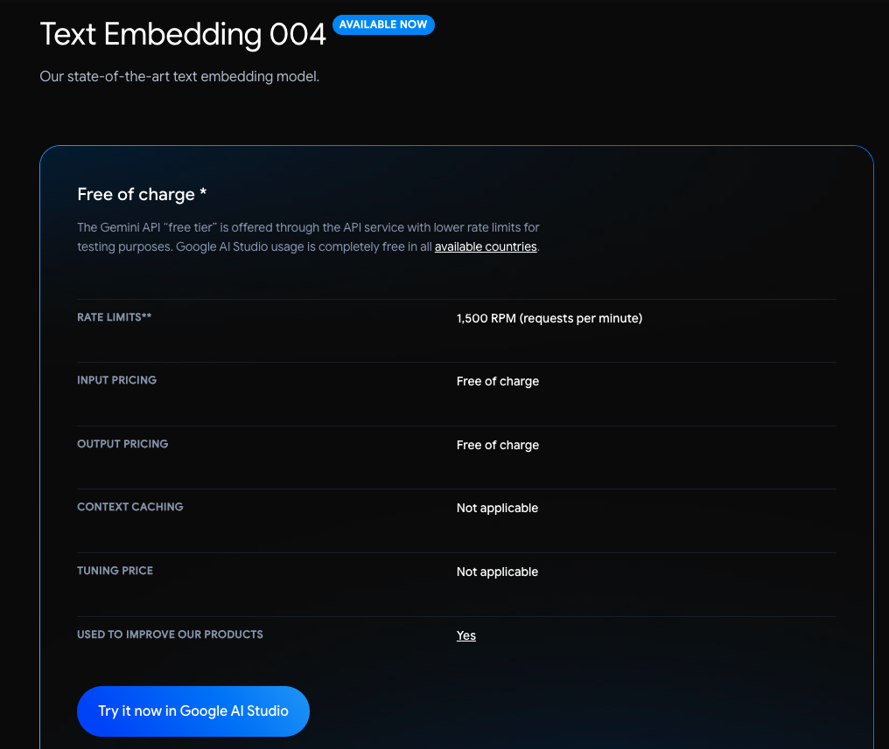
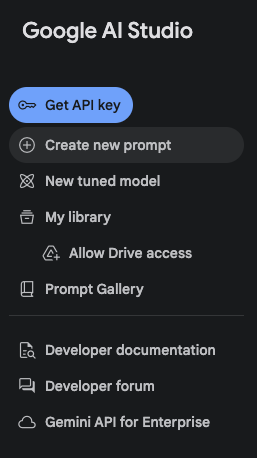
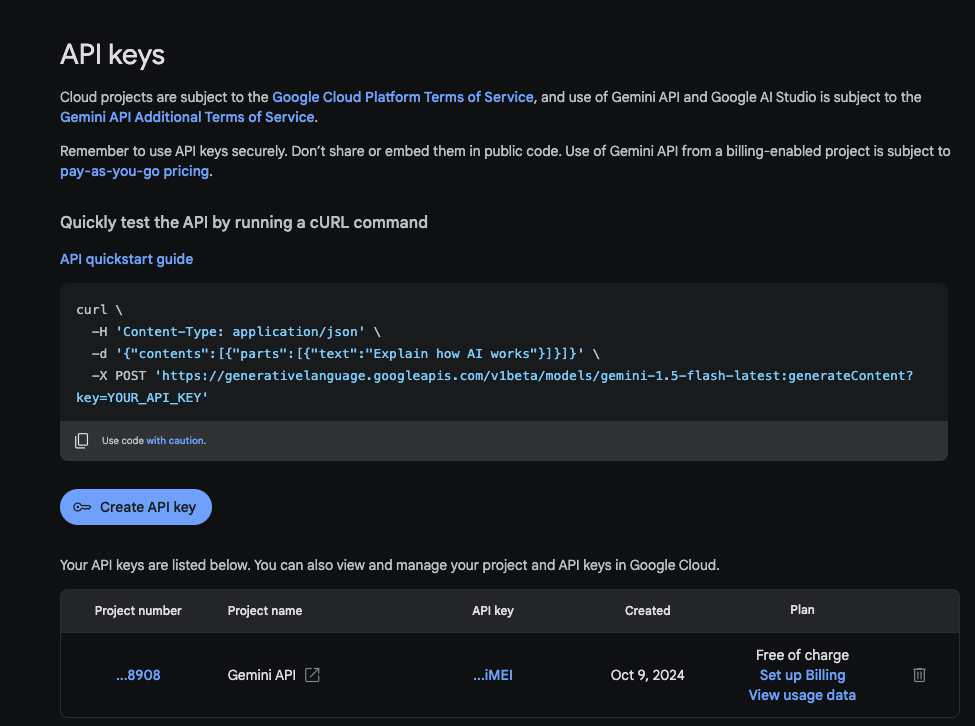

# 🔑 Google Gemini API Key Setup Guide

## Why Do You Need This?

The **AI Basics RAG Service** uses Google Gemini AI to generate intelligent answers. To use it, you need a free API key.

## 📝 Step-by-Step Instructions

### Step 1: Get the API Key

1. Go to the [Gemini API pricing page](https://ai.google.dev/pricing?hl=pl#1_5flash)

2. Click **"Try it now in Google AI Studio"**

   

3. You will be redirected to **Google AI Studio**. Click **"Get API Key"**

   

4. Click **"Create API Key"** and copy the generated key

   

5. Your API key will start with `AIzaSy...` and look like:
   ```
   AIzaSyABC123...xyz789
   ```

### Step 2: Save the API Key

**Option A: Using env_setup.sh (Recommended)**

```bash
# 1. Copy the example file
cp env_setup.sh.example env_setup.sh

# 2. Edit with your favorite editor
nano env_setup.sh
# or
code env_setup.sh
# or
vim env_setup.sh

# 3. Replace YOUR_API_KEY_HERE with your actual key
export GOOGLE_API_KEY="AIzaSy..."  # Your actual key here

# 4. Save and exit

# 5. Load the environment variables
source env_setup.sh
```

You should see:
```
✅ Environment variables set:
   GOOGLE_API_KEY: AIzaSy...
   GEMINI_MODEL: gemini-2.0-flash-exp
```

**Option B: Export manually (temporary, only for current session)**

```bash
export GOOGLE_API_KEY="AIzaSy..."
export GEMINI_MODEL="gemini-2.0-flash-exp"
```

**Option C: Add to ~/.bashrc (permanent)**

```bash
echo 'export GOOGLE_API_KEY="AIzaSy..."' >> ~/.bashrc
echo 'export GEMINI_MODEL="gemini-2.0-flash-exp"' >> ~/.bashrc
source ~/.bashrc
```

### Step 3: Verify Setup

```bash
# Check if the key is set
echo $GOOGLE_API_KEY

# Should display your API key
```

### Step 4: Run the System

```bash
./run_rag.sh
# or
./main.sh  # Choose option 1
```

---

## 🔒 Security Important!

### ⚠️ NEVER commit your API key to git!

The project is configured to protect your key:

✅ **env_setup.sh** is in `.gitignore` (your actual key - SAFE)  
✅ **env_setup.sh.example** is tracked (template - SAFE)  
✅ **env_setup.sh.backup** is in `.gitignore` (backup - SAFE)

### Before committing, always check:

```bash
git status

# env_setup.sh should NOT appear in the list
# If it does, it's NOT in .gitignore - DON'T COMMIT!
```

### If you accidentally committed your key:

```bash
# 1. Remove from git (but keep locally)
git rm --cached env_setup.sh

# 2. Regenerate your API key immediately
#    Go to https://aistudio.google.com/apikey
#    Delete the old key and create a new one

# 3. Update env_setup.sh with the new key
```

---

## 💰 Pricing Information

### Free Tier (Sufficient for this project)

According to [Google's pricing](https://ai.google.dev/pricing):

**Gemini 2.0 Flash (Experimental):**
- ✅ **FREE** for development
- ✅ Input: Free
- ✅ Output: Free  
- ✅ Rate limits: 15 RPM, 1,500 RPD, 1M TPD

**Perfect for:**
- Learning and experimentation
- Small projects
- This RAG system (low volume)

### Paid Tier (If you need more)

Only needed for:
- Production applications
- High request volumes
- Commercial projects

**Costs:** ~$1.25 per 1M input tokens, ~$10 per 1M output tokens

For this educational project, **free tier is more than enough!**

---

## 🆘 Troubleshooting

### "GOOGLE_API_KEY not found"

**Problem:** Environment variable not set

**Solution:**
```bash
source env_setup.sh
```

If that doesn't work:
```bash
# Check if file exists
ls -la env_setup.sh

# If not, create it
cp env_setup.sh.example env_setup.sh
nano env_setup.sh  # Add your key
source env_setup.sh
```

### "Invalid API key" or "403 Forbidden"

**Problem:** API key is incorrect or expired

**Solutions:**
1. Check if you copied the key correctly (no extra spaces)
2. Regenerate the key at https://aistudio.google.com/apikey
3. Update env_setup.sh with the new key
4. Run `source env_setup.sh` again

### "Quota exceeded"

**Problem:** You've hit the free tier limits

**Solutions:**
1. Wait (limits reset daily)
2. Upgrade to paid tier (if needed for production)
3. Check your usage at https://aistudio.google.com/

### "API key visible in git status"

**Problem:** .gitignore not working properly

**Solution:**
```bash
# Make sure it's in .gitignore
grep env_setup.sh .gitignore

# If it shows up in git status anyway:
git rm --cached env_setup.sh
git commit -m "Remove API key from tracking"
```

---

## 📚 Additional Resources

- [Get API Key](https://aistudio.google.com/apikey)
- [Gemini API Pricing](https://ai.google.dev/pricing)
- [Gemini API Documentation](https://ai.google.dev/)
- [Google AI Studio](https://aistudio.google.com/)

---

## ✅ Checklist

Before running the project:

- [ ] Got API key from Google AI Studio
- [ ] Created `env_setup.sh` from example
- [ ] Added real API key to `env_setup.sh`
- [ ] Ran `source env_setup.sh`
- [ ] Verified key is set: `echo $GOOGLE_API_KEY`
- [ ] Confirmed `env_setup.sh` is NOT in `git status`

All done? Run:
```bash
./main.sh
```

---

**Remember: Your API key is a secret - never share it or commit it to git!** 🔒

